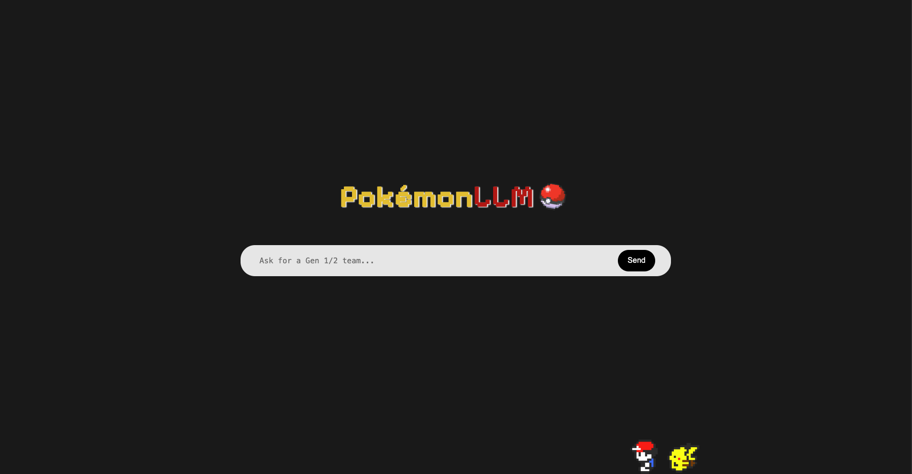
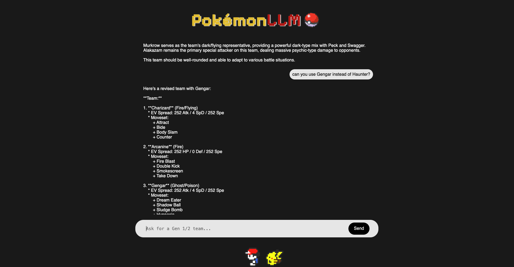

# PokémonLLM
Final project for my COSC490: Introduction to Large Language Models course. This project is a Pokémon battle assistant chatbot built using Meta's LLaMA-3.1-8B-Instruct model as its foundation and ran locally with Ollama. To enhance the accuracy and legality of the generated responses, I implemented techniques such as post-generation filtering, Retrieval-Augmented Generation (RAG), and fine-tuning. The assistant includes a user-friendly web interface and can be accessed in the browser via a Flask server.
> ⚠️ **Note:** You must have [Ollama](https://ollama.com) installed to run the model locally. Ollama is required to load the GGUF quantized model and serve it for the chatbot.

> ⚠️ **Note:** You must download the `llama-3.1-8b-instruct-q4_k_m.gguf` from HuggingFace file and place it in /llama3-gguf. Your file structure should look like
```bash
llama3-gguf/
├── llama-3.1-8b-instruct-q4_k_m.gguf
└── Modelfile
```


## UI



## Structure
```bash
.
├── chatbot_core.py                         # PokemonLLM logic: RAG, post-generation filtering
├── flask_app.py                            # Flask server entry point 
├── pokemon_gen12_moveset.json              # legal moveset data for gen 1 & 2 used in RAG 
├── README.md                                     
├── llama3-gguf                             # llama3 model and Modelfile used to create assistant via Ollama  
│   ├── llama-3.1-8b-instruct-q4_k_m.gguf
│   └── Modelfile
├── static                                  # CSS, images, fonts
│   ├── global.css
│   ├── PixelifySans-VariableFont_wght.ttf
│   ├── pokeball-removebg-preview.png
│   └── pokewalk.gif
└── templates                               # HTML and JS
    └── index.html
```

## Tech Stack

**Frontend:**
- HTML5
- CSS3

**Backend:**
- Python 3.10+
- Flask

**Model Serving:**
- Ollama (LLaMA 3.1 8B Instruct via GGUF)
- llama.cpp / GGUF model integration

**LLM Enhancements:**
- Post-generation filtering
- Retrieval-Augmented Generation (RAG)
- Fine-tuning (limited scale)

## How to Run

### 1. Create and Activate environment
```bash
- python3 -m venv venv
- source venv/bin/activate
```
### 2. Install dependencies
```bash
- pip install -r requirements.txt
```

### 3. Create Assistant Model with modelfile
```bash
- cd to /llama3-gguf
- run ollama create pokemon-assistant-v3 -f Modelfile
```

### 4. Run Flask server
```bash
- Ensure Ollama server is running - Ollama serve &
- python flask_app.py
```

## Authors
- William Lamuth